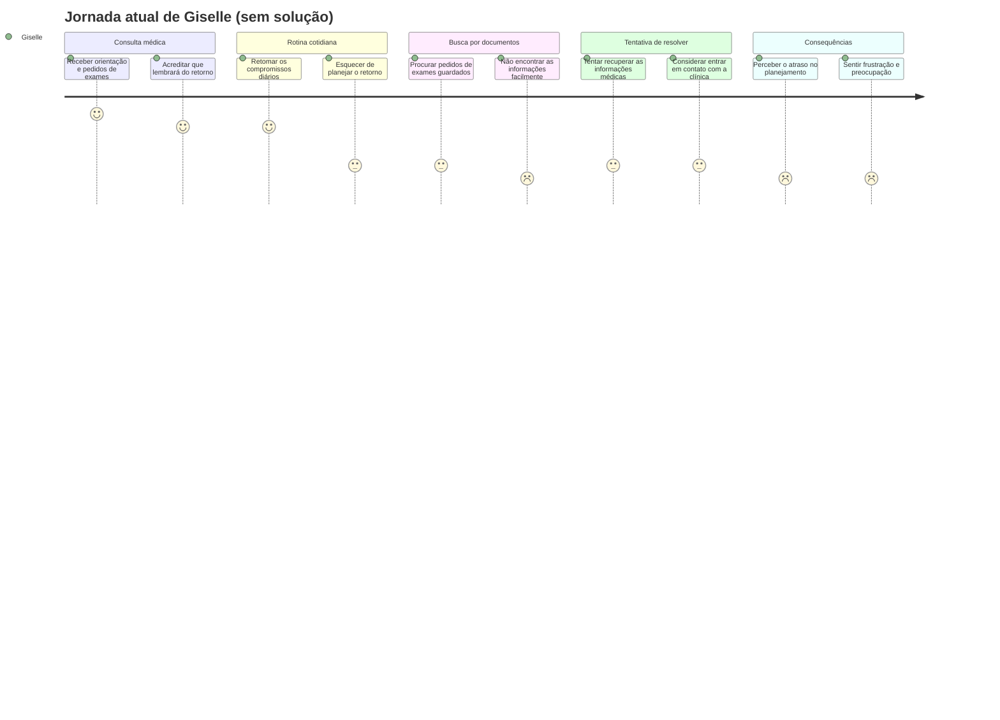

# 1. Cenário de Análise/Problema

Giselle Souza tem 24 anos e costuma utilizar o celular para organizar seus compromissos pessoais e acadêmicos. Apesar de ter facilidade com tecnologia, ela enfrenta dificuldades para manter sua rotina de saúde organizada.

Durante uma consulta médica, o médico recomenda que ela retorne em seis meses e entrega alguns pedidos de exames impressos. Giselle acredita que ainda falta muito tempo para a próxima consulta e acaba não registrando a orientação no calendário.

Ao voltar à rotina, esquece gradualmente que precisa marcar o retorno e guarda os documentos em uma gaveta junto com outros papéis. Meses depois, quando se lembra de que precisa voltar ao médico, percebe que não sabe exatamente quando deveria ter agendado a consulta.

Para piorar, não consegue encontrar o pedido de exame de que precisa entre os documentos guardados. Frustrada, Giselle perde tempo procurando as folhas e considera entrar em contato com a clínica para solicitar uma segunda via.

Mesmo utilizando o celular diariamente, ela sente dificuldade para acompanhar o próprio histórico médico e teme deixar passar orientações importantes para sua saúde.

---

# 2. Questões de Refinamento

- Isso acontece com todos os retornos médicos de Giselle ou principalmente com aqueles que precisam ser agendados meses depois?
- Por que Giselle esquece de registrar os retornos, mesmo utilizando um calendário digital diariamente?
- Com que frequência ela perde documentos médicos ou tem dificuldade para encontrá-los?
- Ela já precisou solicitar uma segunda via de um pedido de exame ou atrasar um procedimento por não encontrar o documento?
- Giselle já tentou utilizar alarmes, anotações ou outros métodos para evitar esses esquecimentos? O que aconteceu?
- O problema afeta somente Giselle ou ela também precisa organizar documentos médicos de familiares?
- Quais são as principais consequências dessa desorganização: perda de tempo, gastos extras, preocupação ou atraso no acompanhamento médico?

---

# 3. Refinamento do Cenário de Análise/Problema

Giselle tem facilidade para utilizar ferramentas digitais e costuma consultar o calendário do celular para organizar seus compromissos. Entretanto, quando recebe uma orientação médica para retornar em seis meses, ela nem sempre registra a necessidade de agendar uma nova consulta.

Como o retorno parece distante, acaba priorizando outras responsabilidades e confia que conseguirá se lembrar quando chegar o momento.

Enquanto isso, os pedidos de exames impressos ficam guardados em uma gaveta, misturados a outros documentos. Quando precisa consultar uma dessas guias ou verificar as orientações da consulta anterior, Giselle perde tempo procurando entre as folhas e nem sempre encontra o que procura.

Ao perceber que precisa marcar o retorno, pode descobrir que deixou passar o período recomendado e não tem todas as informações necessárias à mão. Ela considera entrar em contato com a clínica para esclarecer dúvidas ou solicitar uma segunda via, o que acrescenta mais uma tarefa à sua rotina.

A situação gera frustração porque, apesar de sua familiaridade com a tecnologia, Giselle ainda depende da memória e da organização de papéis físicos para acompanhar a própria saúde.

O problema se torna especialmente difícil quando existe um intervalo longo entre as consultas, pois ela perde de vista tanto a necessidade de agendamento quanto a localização dos documentos relacionados ao atendimento anterior.

---

# 4. Contexto de Uso

### Contexto tecnológico

Giselle utiliza o celular diariamente, principalmente para organizar compromissos pessoais e consultar seu calendário digital.

### Contexto social

É uma jovem adulta que procura administrar a própria saúde enquanto concilia estudos e outras responsabilidades.

### Contexto econômico

A procura por documentos e o contato adicional com a clínica podem gerar perda de tempo e eventuais custos indiretos. Não há informações suficientes para determinar sua condição financeira.

### Contexto cultural

Consultas médicas frequentemente envolvem orientações verbais e documentos impressos, como receitas e pedidos de exames.

### Situações de uso

* O problema começa durante ou logo após a consulta, quando Giselle recebe orientações que precisarão ser lembradas meses depois.
* Ao retornar à rotina, ela prioriza tarefas mais imediatas e pode deixar de registrar a necessidade de agendamento futuro.
* Os documentos físicos ficam guardados em casa, misturados a outros papéis, dificultando sua localização quando necessários.
* A dificuldade se intensifica quando Giselle precisa marcar o retorno e recuperar informações de uma consulta anterior ao mesmo tempo.
* A interação com clínicas acontece principalmente pelo WhatsApp ou por outros canais de atendimento, quando precisa confirmar informações ou resolver pendências.

### Privacidade

Como os documentos médicos contêm informações pessoais, sua privacidade deve ser considerada no ambiente em que são guardados e consultados.

---

# 5. Jornada do Usuário (Atual, Sem Solução) — Giselle

| Etapa                                       | O que acontece                                                                                            | Estado emocional      |
| ------------------------------------------- | --------------------------------------------------------------------------------------------------------- | --------------------- |
| **1. Consulta médica**                      | Giselle recebe a orientação de retornar em seis meses e leva pedidos de exames impressos.                 | Tranquila / confiante |
| **2. Retorno à rotina**                     | Ela volta aos compromissos cotidianos e não registra adequadamente a necessidade de agendar o retorno.    | Despreocupada         |
| **3. Documentos guardados**                 | Os pedidos de exames ficam misturados a outros papéis em uma gaveta.                                      | Indiferente           |
| **4. Necessidade de consultar informações** | Giselle procura um pedido de exame, mas não consegue encontrá-lo facilmente.                              | Frustrada             |
| **5. Lembrança do retorno**                 | Ela percebe que precisa marcar uma nova consulta, mas não tem certeza de quando deveria ter feito isso.   | Preocupada / insegura |
| **6. Tentativa de resolver**                | Considera procurar novamente os documentos ou entrar em contato com a clínica para recuperar informações. | Cansada / frustrada   |
| **7. Consequências**                        | Giselle percebe que perdeu tempo e pode ter deixado passar o período recomendado para o retorno.          | Decepcionada          |

